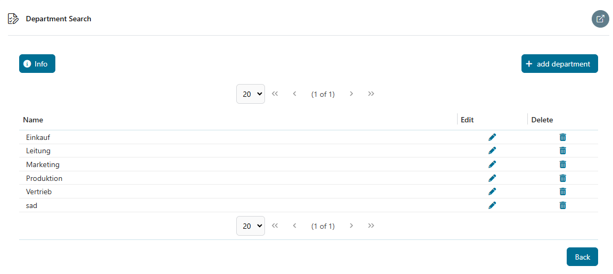
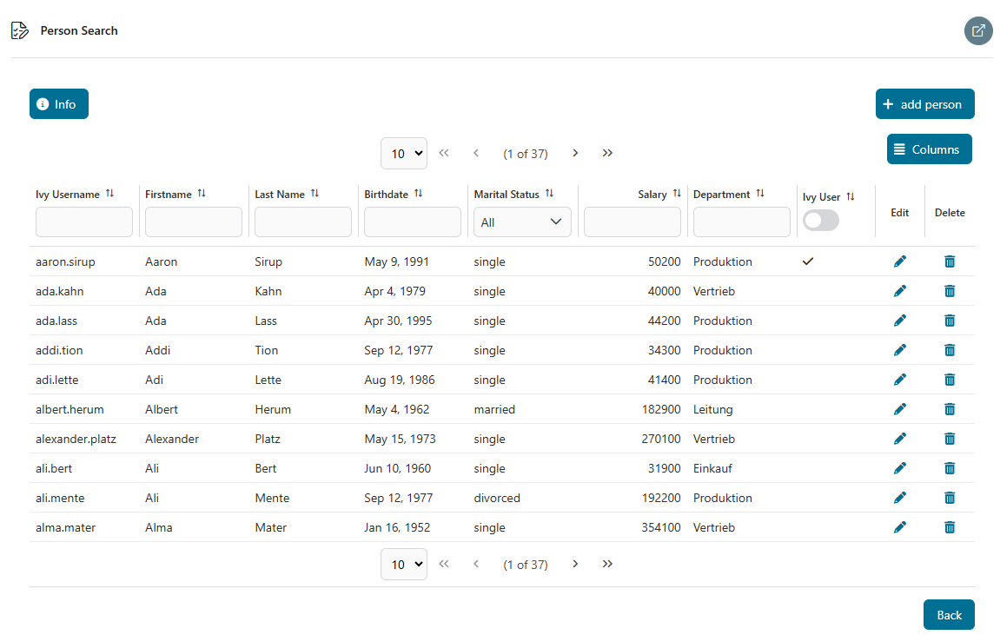

# Persistence Utils
Axon Ivy's JPA Persistence Lib utility helps you accelerate process automation initiatives by introducing an abstraction DAO layer. This utility:
- Allows robust and complex database access based on the [JPA 2.2 standard](https://www.oracle.com/java/technologies/persistence-jsp.html).
- Helps you create DAO classes for your entities with direct access to databases using standard APIs
- Simplifies the creation of typical entity classes
- Supports you with an easy-to-copy demo implementation to reduce your integration effort.

## Demo
Implemented features:
- Persistence Library
- Demo project with bean validation example
- JUnit Tests for persistence library and demo project
- DBUnit testdata to use in demo project and also in JUnit tests

## Test data
Prepare test data maintained in an integrated excel file using DBUnit.
The same test data is used in the UI and in JUnit tests.

## Departments
List, edit and delete departments. Deleting a department will be done on a logical
level using features of the `AuditableEntity`.

## Persons
List, edit and delete persons. Persons can be synced to Ivy Users.

In this list, a person can only see other persons of the same department.
Visibility of persons is implemented directly in the PersonDAO and enforced
for almost all DAO functions. Only the administrator role is allowed to see all persons.

Bean validation is used to validate person data. Validations can cause Errors (e.g. if
a mandatory field is missing) or Warnings (e.g. if the Ivy username does not follow the
naming convention firstname.lastname).

The list is featuring sorting and filtering of columns with a lazy data-model. This means,
that sorting, filtering and paging will be done by the database with a dynamically built
query. 

